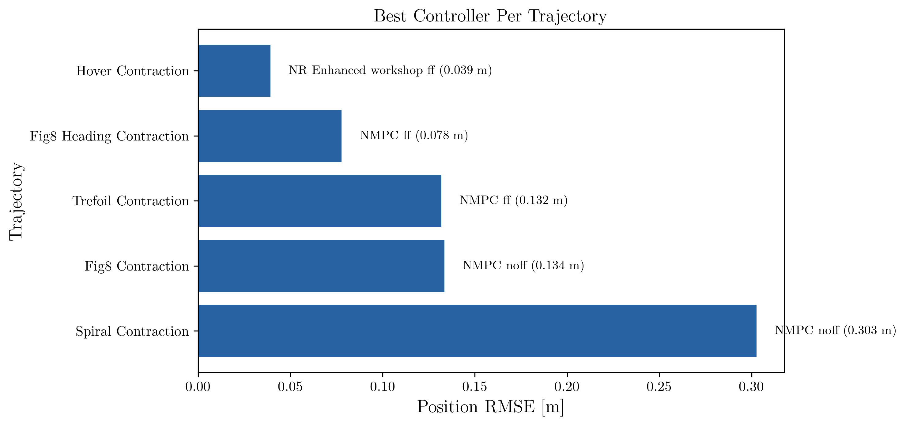
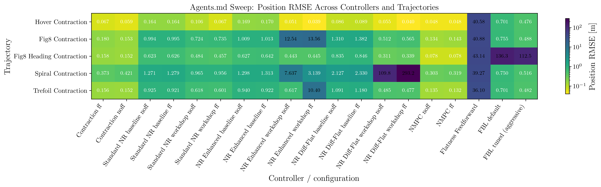
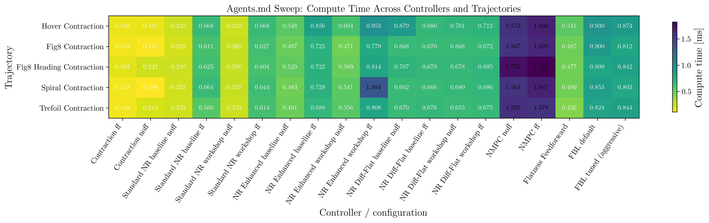
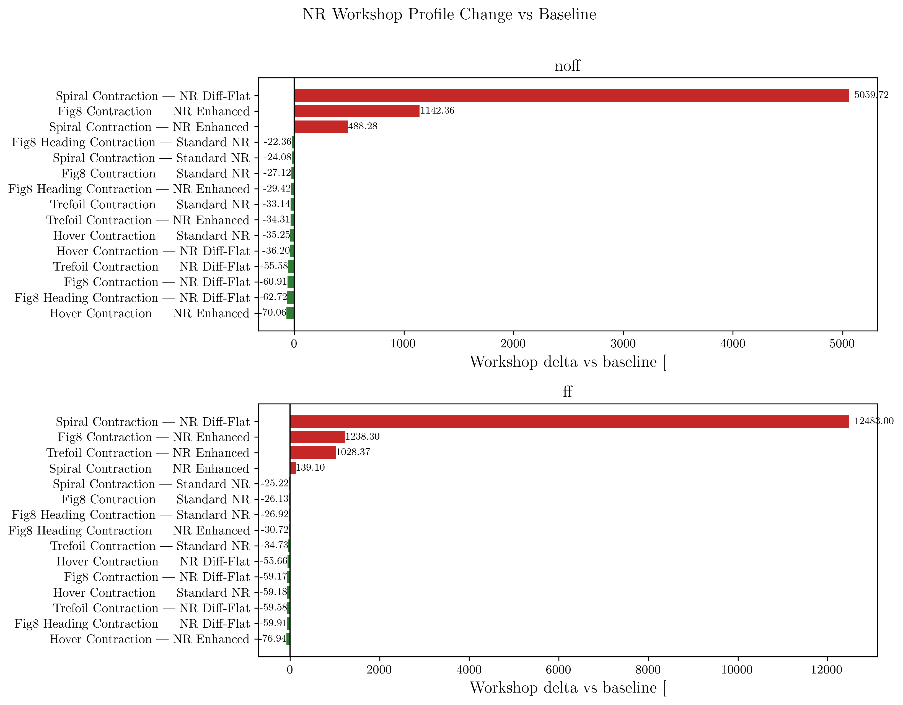
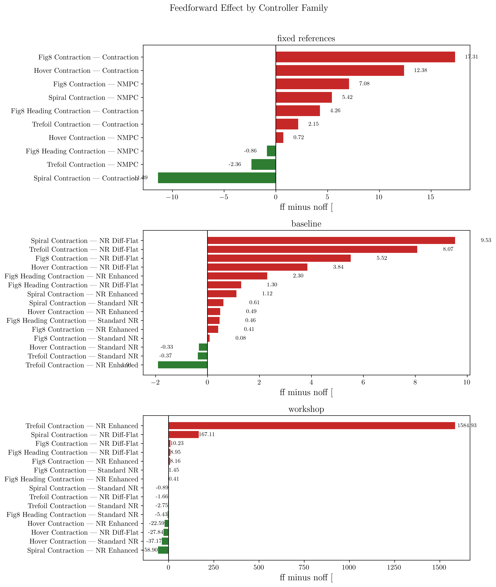
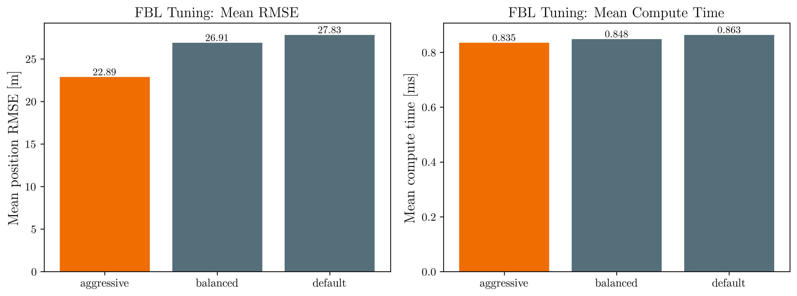

# Newton-Raphson Workshop Profiles

## Goal

On April 1, 2026, the Newton-Raphson standard controller was reworked to test
the structural fixes that had already been identified as likely root causes of
the persistent XY shift and Z offset:

1. Long lookahead with a constant-input prediction model
2. No integral action for steady-state bias rejection
3. A single Newton update per 100 Hz control cycle

The requirement for this pass was:

- validate the proposed improvements on the Python controller first
- keep the original controller available for direct comparison
- only mirror the changes to C++ after the Python result was clearly better

## Implemented Profiles

The Python and C++ `newton_raphson` controllers now expose two named profiles.

| Profile | Lookahead | Predictor | Iterations | `alpha` | Integral gain | Integral limit |
| --- | ---: | --- | ---: | --- | --- | --- |
| `baseline` | `1.2 s` | Zero-order hold | `1` | `[50, 60, 60, 60]` | `[0, 0, 0, 0]` | `[0, 0, 0, 0]` |
| `workshop` | `0.8 s` | First-order hold | `2` | `[45, 55, 55, 45]` | `[0.35, 0.35, 0.50, 0.12]` | `[0.75, 0.75, 0.50, 0.30]` |

Interpretation:

- `baseline` preserves the pre-workshop structure for apples-to-apples testing.
- `workshop` applies all validated structural fixes in one coherent profile.

## Code Changes

### Python

Files:

- `src/newton_raphson_px4/newton_raphson_px4_utils/controller/newton_raphson_px4.py`
- `src/newton_raphson_px4/newton_raphson_px4_utils/controller/nr_utils.py`
- `src/newton_raphson_px4/newton_raphson_px4/ros2px4_node.py`
- `src/newton_raphson_px4/newton_raphson_px4/run_node.py`

Changes:

- Added explicit `baseline` and `workshop` controller profiles.
- Added bounded integral error accumulation in the node using the current-time
  reference and the actual output `[x, y, z, yaw]`.
- Switched the predictor utilities to support both:
  - zero-order hold on the candidate input
  - first-order hold from `last_input` to `candidate_input`
- Changed the NR control law from a single update to `N` damped Newton
  iterations per cycle.
- Added `--nr-profile {baseline,workshop}` to the Python runner and fly
  pipeline.

### C++

Files:

- `src/newton_raphson_px4_cpp/include/newton_raphson_px4_cpp/controller/newton_raphson.hpp`
- `src/newton_raphson_px4_cpp/include/newton_raphson_px4_cpp/controller/nr_utils.hpp`
- `src/newton_raphson_px4_cpp/include/newton_raphson_px4_cpp/offboard_control_node.hpp`
- `src/newton_raphson_px4_cpp/src/controller/newton_raphson.cpp`
- `src/newton_raphson_px4_cpp/src/controller/nr_utils.cpp`
- `src/newton_raphson_px4_cpp/src/offboard_control_node.cpp`
- `src/newton_raphson_px4_cpp/src/run_node.cpp`

Changes:

- Mirrored the same profile names and numeric settings as Python.
- Mirrored the FOH predictor, bounded integral term, and multi-iteration NR
  update.
- Removed the previous Python/C++ alpha mismatch so both `baseline` profiles are
  actually comparable.

Build verification:

- `colcon build --symlink-install --packages-up-to newton_raphson_px4_cpp`
- Result on April 1, 2026: build succeeded inside `px4_controllers`

## Python Validation

Trajectory:

- `fig8_horz`

Mode:

- headless PX4 SITL

Results directories:

- `src/data_analysis/results/nr_python_baseline_fig8_horz_20260401`
- `src/data_analysis/results/nr_python_workshop_fig8_horz_20260401`

Commands used:

```bash
python3 src/workspace_tools/fly_pipeline.py \
  --workspace-root /home/egmc/ws_contraction_px4 \
  --platform sim \
  --trajectory fig8_horz \
  --controller newton_raphson \
  --headless \
  --nr-profile baseline \
  --results-dir /home/egmc/ws_contraction_px4/src/data_analysis/results/nr_python_baseline_fig8_horz_20260401

python3 src/workspace_tools/fly_pipeline.py \
  --workspace-root /home/egmc/ws_contraction_px4 \
  --platform sim \
  --trajectory fig8_horz \
  --controller newton_raphson \
  --headless \
  --nr-profile workshop \
  --results-dir /home/egmc/ws_contraction_px4/src/data_analysis/results/nr_python_workshop_fig8_horz_20260401
```

Measured summary:

| Profile | Position RMSE (m) | Compute time (ms) |
| --- | ---: | ---: |
| `baseline` | `0.49052100596517856` | `0.9548286797622562` |
| `workshop` | `0.2414379453981194` | `1.5734922165838194` |

Delta:

- RMSE improvement: `-50.78%`
- Compute time increase: `+64.79%`

Interpretation:

- The workshop profile roughly halved the Python position RMSE on this run.
- The compute-time increase stayed well below the 10 ms budget of the 100 Hz
  control loop.
- That was sufficient to justify keeping the workshop profile and porting the
  same structure to C++.

## Operational Notes

- The analysis pipeline aligns the reference using the logged lookahead time.
  That means the baseline and workshop runs are both evaluated with their own
  configured lookahead (`1.2 s` vs `0.8 s`).
- The workshop profile should be treated as a validated candidate, not yet the
  default. Keep `baseline` available until the C++ profile is flight-validated
  on the same trajectories.

## Enhanced Controller Integration

The newly added `newton_raphson_enhanced_px4` submodule was also integrated into
the same workspace infrastructure on April 1, 2026 so it can be run through the
same headless SITL pipeline, use the shared platform and trajectory packages,
and emit analysis-compatible logs.

Files:

- `src/newton_raphson_enhanced_px4/newton_raphson_enhanced_px4/run_node.py`
- `src/newton_raphson_enhanced_px4/newton_raphson_enhanced_px4/ros2px4_node.py`
- `src/newton_raphson_enhanced_px4/newton_raphson_enhanced_px4_utils/controller/nr_enhanced.py`
- `src/newton_raphson_enhanced_px4/newton_raphson_enhanced_px4_utils/controller/nr_utils.py`
- `src/newton_raphson_enhanced_px4/package.xml`
- `src/workspace_tools/fly_pipeline.py`
- `Makefile`

Integration changes:

- Replaced the old logger wiring with `ros2_logger` so logs land in the shared
  `src/data_analysis/log_files/...` structure.
- Normalized the logged metadata fields to match the analysis pipeline
  expectations: `controller`, `lookahead_time`, and `comp_time`.
- Unified gravity to `9.8` to match the rest of the workspace and Gazebo.
- Added `--nr-profile {baseline,workshop}` to the enhanced runner and to the
  top-level fly pipeline.
- Added the enhanced controller to the default multi-controller sets and the
  `run_newton_raphson_enhanced` Make target.

The enhanced Python package now exposes the same two explicit profiles:

| Profile | Lookahead | Predictor | Iterations | `alpha` | Integral gain | Integral limit |
| --- | ---: | --- | ---: | --- | --- | --- |
| `baseline` | `1.2 s` | Zero-order hold | `1` | `[30, 40, 40, 40]` | `[0, 0, 0, 0]` | `[0, 0, 0, 0]` |
| `workshop` | `0.8 s` | First-order hold | `2` | `[30, 40, 40, 40]` | `[0.35, 0.35, 0.50, 0.12]` | `[0.75, 0.75, 0.50, 0.30]` |

Interpretation:

- `baseline` is the integrated form of the original enhanced controller.
- `workshop` adds the same structural fixes that helped the standard Python
  controller: shorter lookahead, FOH prediction, bounded integral action, and
  two damped Newton updates.

## Enhanced Python Validation

Trajectory:

- `fig8_horz`

Mode:

- headless PX4 SITL

Results directories:

- `src/data_analysis/results/nr_enhanced_python_baseline_fig8_horz_20260401`
- `src/data_analysis/results/nr_enhanced_python_workshop_fig8_horz_20260401`

Commands used:

```bash
python3 src/workspace_tools/fly_pipeline.py \
  --workspace-root /home/egmc/ws_contraction_px4 \
  --platform sim \
  --trajectory fig8_horz \
  --controller newton_raphson_enhanced \
  --headless \
  --nr-profile baseline \
  --results-dir /home/egmc/ws_contraction_px4/src/data_analysis/results/nr_enhanced_python_baseline_fig8_horz_20260401

python3 src/workspace_tools/fly_pipeline.py \
  --workspace-root /home/egmc/ws_contraction_px4 \
  --platform sim \
  --trajectory fig8_horz \
  --controller newton_raphson_enhanced \
  --headless \
  --nr-profile workshop \
  --results-dir /home/egmc/ws_contraction_px4/src/data_analysis/results/nr_enhanced_python_workshop_fig8_horz_20260401
```

Measured summary:

| Profile | Position RMSE (m) | Compute time (ms) |
| --- | ---: | ---: |
| `baseline` | `0.35749240937686216` | `0.3395175933837423` |
| `workshop` | `0.23281274706265945` | `0.32021449162404647` |

Delta:

- RMSE improvement: `-34.88%`
- Compute time change: `-5.69%`

Interpretation:

- The enhanced controller improved materially after the same structural
  workshop changes were integrated.
- On this run, the workshop profile reduced RMSE by about a third while also
  slightly lowering measured compute time.
- That means the standard and enhanced Python controllers now both show a
  positive response to the same profile split, but the standard Python package
  still achieved the larger absolute improvement on this particular trajectory.

## NR Diff-Flat Integration and Validation

The `nr_diff_flat_px4` package was then reworked to expose the same explicit
`baseline` and `workshop` comparison structure on April 1, 2026.

Files:

- `src/nr_diff_flat_px4/nr_diff_flat_px4_utils/controller/profiles.py`
- `src/nr_diff_flat_px4/nr_diff_flat_px4_utils/controller/nr_diff_flat_px4_jax.py`
- `src/nr_diff_flat_px4/nr_diff_flat_px4_utils/controller/nr_diff_flat_px4_numpy.py`
- `src/nr_diff_flat_px4/nr_diff_flat_px4/ros2px4_node.py`
- `src/nr_diff_flat_px4/nr_diff_flat_px4/run_node.py`
- `src/workspace_tools/fly_pipeline.py`
- `Makefile`

Profile definitions:

| Profile | Lookahead | Iterations | Damping | `alpha` | Integral gain | Integral limit |
| --- | ---: | ---: | ---: | --- | --- | --- |
| `baseline` | `0.8 s` | `1` | `1.0` | `[20, 30, 30, 30]` | `[0, 0, 0, 0]` | `[0, 0, 0, 0]` |
| `workshop` | `0.5 s` | `2` | `0.65` | `[24, 34, 34, 24]` | `[0.30, 0.30, 0.45, 0.10]` | `[0.75, 0.75, 0.50, 0.30]` |

Structural changes:

- Added an explicit profile file so repeated experiments use named settings
  instead of one-off edits.
- Added bounded integral error accumulation and wrapped yaw tracking error.
- Converted the controller update into a damped multi-iteration correction loop.
- Added profile-aware logging and fly-pipeline support for
  `--nr-profile {baseline,workshop}`.

Python validation trajectory:

- `fig8_contraction`

Results directories:

- `src/data_analysis/results/nr_df_python_baseline_fig8_contraction_20260401`
- `src/data_analysis/results/nr_df_python_workshop_fig8_contraction_20260401`

Measured summary:

| Profile | Position RMSE (m) | Compute time (ms) |
| --- | ---: | ---: |
| `baseline` | `1.2671914577825913` | `0.66611766815181` |
| `workshop` | `0.4935018617838357` | `0.6281820933023587` |

Delta:

- RMSE improvement: `-61.05%`
- Compute time change: `-5.69%`

Interpretation:

- The same workshop pattern also helped the diff-flat NR family materially.
- The absolute RMSE is still higher than desired on this contraction-family
  benchmark, but the direction of change is unambiguous and large enough to
  justify keeping the profile split for wider sweeps.

## Generalized FBL Integration

The legacy `ff_f8_px4` package was generalized so it can now execute the full
contraction trajectory family through the shared workspace pipeline instead of
being hard-coded to `fig8_contraction`.

Files:

- `src/ff_f8_px4/ff_f8_px4/ros2px4_node.py`
- `src/ff_f8_px4/ff_f8_px4/run_node.py`
- `src/ff_f8_px4/README.md`
- `src/ff_f8_px4/docs/ff_f8_controller.qmd`
- `src/workspace_tools/fly_pipeline.py`
- `src/data_analysis/utilities.py`
- `Makefile`

Integration changes:

- Added `--trajectory` support for the contraction-trajectory family:
  `hover_contraction`, `fig8_contraction`, `fig8_heading_contraction`,
  `spiral_contraction`, and `trefoil_contraction`.
- Fixed the JIT trajectory context so `--double-speed` now reaches the shared
  flatness trajectory evaluation.
- Added a top-level `fbl` controller alias in the fly pipeline. This alias runs
  the same package with `--p-feedback` enabled, which is the mode intended for
  comparison sweeps.
- Added analysis-name mappings so the logs summarize as `FBL` instead of
  `ff_f8`.

Validated headless results:

| Trajectory | Position RMSE (m) | Compute time (ms) | Results directory |
| --- | ---: | ---: | --- |
| `fig8_contraction` | `0.7294611583222743` | `1.9943952560424312` | `src/data_analysis/results/fbl_python_fig8_contraction_20260401` |
| `spiral_contraction` | `0.753744301761783` | `0.976171493530225` | `src/data_analysis/results/fbl_python_spiral_contraction_20260401` |

Interpretation:

- The generalized FBL path is now operational on more than one contraction
  trajectory, so it is ready to participate in the wider comparison matrix.
- On the current `fig8_contraction` run, FBL remains a fixed reference rather
  than a replacement for the workshop NR profiles.

## Full Agents.md Sweep

The widened contraction-family sweep requested in `src/Agents.md` is now
complete. The run tag used for the final matrix is:

- `agents_matrix_20260401`

Tracked copies of the generated aggregate artifacts live in:

- `docs/generated/agents_matrix_20260401/agents_main_matrix.csv`
- `docs/generated/agents_matrix_20260401/position_rmse_table.md`
- `docs/generated/agents_matrix_20260401/comp_time_table.md`
- `docs/generated/agents_matrix_20260401/fbl_tuning_summary.md`
- `docs/generated/agents_matrix_20260401/nr_workshop_improvements.md`
- `docs/generated/agents_matrix_20260401/feedforward_effects.md`
- `docs/generated/agents_matrix_20260401/cpp_acceptance_summary.md`

These tables are copied from the gitignored experiment directory so the
workspace docs reference tracked artifacts instead of ephemeral run outputs.

## Comparison Plots

The generated figures for the completed sweep live in:

- `docs/generated/agents_matrix_20260401/plots/`

The most useful plot set is:

- best-per-trajectory snapshot
- full RMSE heatmap
- full compute-time heatmap
- NR workshop delta plot
- feedforward delta plot
- FBL tuning summary
- C++ acceptance summary














## Best-by-Trajectory Snapshot

Across the full comparison set, the best position-tracking result on each
trajectory was:

| Trajectory | Best result | Position RMSE (m) | Compute time (ms) |
| --- | --- | ---: | ---: |
| `hover_contraction` | `NR Enhanced workshop ff` | `0.039213` | `0.952705` |
| `fig8_contraction` | `NMPC noff` | `0.133517` | `1.566523` |
| `fig8_heading_contraction` | `NMPC ff` | `0.077771` | `1.823588` |
| `spiral_contraction` | `NMPC noff` | `0.302704` | `1.562733` |
| `trefoil_contraction` | `NMPC ff` | `0.131785` | `1.570208` |

Interpretation:

- NMPC was the strongest fixed reference on all five trajectories.
- The only trajectory where an NR-family controller beat NMPC outright was
  `hover_contraction`, where `NR Enhanced workshop ff` reached the best overall
  RMSE.
- The full per-trajectory matrix is in
  `docs/generated/agents_matrix_20260401/position_rmse_table.md`.

## NR Workshop Conclusions

The workshop profile did not generalize uniformly across the NR family.

### Standard NR

Standard NR is the most robust positive result of the workshop pass:

- It improved relative to baseline on all five trajectories in `noff` mode.
- It also improved relative to baseline on all five trajectories in `ff` mode.
- It never became the best overall controller on the contraction-family sweep,
  but it did materially close the gap to the fixed references.

Examples from `docs/generated/agents_matrix_20260401/nr_workshop_improvements.md`:

- `hover_contraction`, `noff`: `0.164176 -> 0.106311` (`-35.25%`)
- `fig8_contraction`, `noff`: `0.994069 -> 0.724469` (`-27.12%`)
- `spiral_contraction`, `noff`: `1.270721 -> 0.964700` (`-24.08%`)

### NR Enhanced

NR Enhanced responded well on some trajectories and failed badly on others:

- strong improvement on `hover_contraction`
- good improvement on `fig8_heading_contraction`
- good improvement on `trefoil_contraction` in `noff`
- catastrophic degradation on `fig8_contraction`
- catastrophic degradation on `spiral_contraction`
- catastrophic degradation on `trefoil_contraction` when combined with `ff`

This means the current enhanced workshop profile is a trajectory-dependent tune,
not a generally safe upgrade.

### NR Diff-Flat

NR Diff-Flat also showed a split outcome:

- strong workshop improvement on `hover_contraction`
- strong workshop improvement on `fig8_contraction`
- strong workshop improvement on `fig8_heading_contraction`
- strong workshop improvement on `trefoil_contraction`
- catastrophic failure on `spiral_contraction`

The spiral results are not subtle. In `docs/generated/agents_matrix_20260401/nr_workshop_improvements.md`,
`NR Diff-Flat` goes from `2.127361` to `109.765922` in `noff`, and from
`2.330099` to `293.196207` in `ff`.

Interpretation:

- Standard NR has the most defensible workshop profile today.
- Enhanced and Diff-Flat still need trajectory-aware retuning or a more robust
  profile split before they can claim the same level of generalization.

## Feedforward Findings

The full per-controller deltas are in
`docs/generated/agents_matrix_20260401/feedforward_effects.md`.

The short version is:

- feedforward usually hurt the fixed references `contraction` and `NMPC`
  or only helped by a negligible amount
- pure flatness feedforward remained unusable as a standalone controller
  on all five trajectories (`36-43 m` RMSE)
- feedforward interacted with the NR family in a controller-specific and
  trajectory-specific way rather than showing any clean global benefit

Representative cases:

- `spiral_contraction`, `contraction`: `ff` helped (`0.421255 -> 0.373273`)
- `trefoil_contraction`, `NMPC`: `ff` helped slightly (`0.134975 -> 0.131785`)
- `hover_contraction`, `Standard NR workshop`: `ff` helped
  (`0.106311 -> 0.066798`)
- `fig8_contraction`, `NR family`: `ff` hurt across the board
- `spiral_contraction`, `NR Diff-Flat workshop`: `ff` made an already bad
  workshop result much worse (`109.77 -> 293.20`)

Interpretation:

- `ff` should be treated as a narrow experimental modifier, not enabled by
  default across controllers.
- The current evidence does not support a general “feedforward helps” claim for
  this workspace.

## FBL Gain Tuning

The FBL package documentation remains in
`src/ff_f8_px4/docs/ff_f8_controller.qmd`, and the completed tuning sweep is
summarized in
`docs/generated/agents_matrix_20260401/fbl_tuning_summary.md`.

Three gain profiles were compared across the five contraction trajectories:

| Profile | Mean RMSE (m) | Mean comp time (ms) | Best single-run RMSE (m) |
| --- | ---: | ---: | ---: |
| `default` | `27.832292` | `0.863431` | `0.700842` |
| `balanced` | `26.905735` | `0.848224` | `0.586903` |
| `aggressive` | `22.890449` | `0.834896` | `0.475773` |

Outcome:

- `aggressive` is the best available FBL comparison profile in this workspace.
- It improved the mean RMSE by about `17.76%` relative to `default`.
- Even after tuning, FBL remains far behind NMPC and the contraction controller
  on the common five-trajectory set.
- `fig8_heading_contraction` is still the clear failure case for FBL.

## C++ Acceptance

The Python workshop changes are now mirrored in the C++ NR family and were
flight-validated on `fig8_contraction`.

Tracked table:

- `docs/generated/agents_matrix_20260401/cpp_acceptance_summary.md`

Measured C++ deltas:

- `Standard NR C++`: `1.336766 -> 1.009320` (`-24.50%`)
- `NR Enhanced C++`: `1.342013 -> 13.413800` (`+899.53%`)
- `NR Diff-Flat C++`: `1.788206 -> 0.671921` (`-62.42%`)

Interpretation:

- The C++ workshop behavior matches the Python qualitative story on
  `fig8_contraction`.
- Standard and Diff-Flat improve.
- Enhanced workshop is still not a safe general-purpose profile.

## NMPC Metadata Fix

The earlier `Controller = Unknown` issue was traced to a real NMPC logging bug,
not to the analysis notebook.

Root cause in the Python package:

- the controller logger was not writing a `controller` field at all
- `z_ref` and `yaw_ref` were also sharing the same log index

Fixes applied:

- `src/nmpc_acados_px4/nmpc_acados_px4/ros2px4_node.py`
  now logs `controller = NMPC` explicitly and uses distinct reference indices
- `src/nmpc_acados_px4_cpp/src/offboard_control_node.cpp`
  now also logs `controller = NMPC`
- `src/data_analysis/utilities.py`
  now normalizes `NMPC`, `nmpc`, `nmpc_acados_px4`, and `nmpc_acados_px4_cpp`
  to the same controller label
- `src/data_analysis/run_analysis.py`
  now fails fast if a summary contains unresolved metadata
- `src/workspace_tools/run_agents_matrix.py`
  now validates summary controller labels against the requested controller set

Validation:

- Python NMPC matrix summaries now report `Controller = NMPC`
- a post-fix C++ smoke run at
  `docs/generated/agents_matrix_20260401/nmpc_cpp_controller_field_smoke_summary.csv`
  also reports `Controller = NMPC` with
  `Position_RMSE_m = 0.048902` on `hover_contraction`

Interpretation:

- the original `Unknown` failure mode is fixed at the package boundary
- the shared analysis path will now fail loudly if the metadata regresses again

## Status Against Agents.md

The requested items are now addressed as follows:

1. The full five-trajectory comparison matrix is complete, including
   baseline/workshop for the NR-family controllers and fixed references for
   `nmpc`, `contraction`, and `fbl`.
2. The workspace now has a full `.qmd` write-up for the workshop and comparison
   pass, with the FBL technical note kept separately in
   `src/ff_f8_px4/docs/ff_f8_controller.qmd`.
3. The contraction controller params integration remains complete and is
   documented in `docs/contraction_controller.qmd`.
4. The Python NR-style changes are mirrored into the C++ NR family and
   acceptance-tested.
5. FBL PID gain tuning is complete, with `aggressive` selected as the current
   comparison profile.
