```{python}
from pathlib import Path
import pandas as pd

DOC_ROOT = Path.cwd()
ARTIFACT_ROOT = DOC_ROOT / "generated" / "pre_fig8_matrix_20260402"

def load_csv(name: str) -> pd.DataFrame:
    return pd.read_csv(ARTIFACT_ROOT / name)
```

# Scope

This report repeats the controller comparison workflow used for the
contraction-family sweep, but on the regular trajectories that appear above
`fig8_contraction` in the workspace trajectory list:

- `hover`
- `yaw_only`
- `circle_horz`
- `circle_vert`
- `fig8_horz`
- `fig8_vert`

The comparison set is:

- `Standard NR`: `baseline/noff`, `baseline/ff`, `workshop/noff`, `workshop/ff`
- `NR Enhanced`: `baseline/noff`, `baseline/ff`, `workshop/noff`, `workshop/ff`
- `NR Diff-Flat`: `baseline/noff`, `baseline/ff`, `workshop/noff`, `workshop/ff`
- `NMPC`: `noff`, `ff`

Tracked aggregate artifacts for this pass live in:

- `docs/generated/pre_fig8_matrix_20260402/`

# Executive Summary

The main one-page summary table is:

- `docs/generated/pre_fig8_matrix_20260402/executive_summary.csv`
- `docs/generated/pre_fig8_matrix_20260402/executive_summary.md`

```{python}
load_csv("executive_summary.csv")
```

Interpretation:

- `best_overall` is the best measured configuration on each regular trajectory.
- `best_nr_family` is the best result among the three Newton-Raphson families.
- `best_nr_minus_nmpc_*` shows how far the best NR-family result still is from
  the best NMPC result on that same trajectory.

# Key Findings

- `NMPC` is still the strongest controller on the regular-trajectory set overall.
  It wins `hover`, `circle_horz`, `circle_vert`, `fig8_horz`, and `fig8_vert`,
  with `ff` usually helping slightly on the horizontal/figure-eight cases.
- `NR Enhanced workshop noff` is the one clear non-NMPC win in this sweep. On
  `yaw_only` it edges out `NMPC ff`, so the enhanced Newton-Raphson law is not
  uniformly dominated on the simpler regular trajectories.
- Within the Newton-Raphson family, the best variant depends on trajectory
  class:
  - `NR Enhanced workshop noff` is the strongest NR-family result on
    `yaw_only` and `circle_horz`.
  - `NR Diff-Flat workshop noff` is the strongest NR-family result on
    `circle_vert`, `fig8_horz`, and `fig8_vert`.
  - `NR Diff-Flat baseline noff` is the best NR-family result on `hover`.
- Feedforward is not a universal improvement on these regular trajectories.
  `NMPC ff` is beneficial on most of the non-hover regular paths, but the
  Newton-Raphson families often regress with `ff`, especially in the workshop
  cases. The most extreme failure in this sweep is `NR Diff-Flat workshop ff`
  on `hover`, which diverges catastrophically and is therefore easy to spot in
  both the RMSE table and the trajectory gallery.
- The regular-trajectory results therefore sharpen the earlier contraction-path
  conclusions:
  - `Standard NR workshop` remains the most reliable general-purpose structural
    improvement for the standard controller.
  - `NR Enhanced workshop` is genuinely strong on some paths, but still does
    not dominate the other NR variants across the board.
  - `NR Diff-Flat workshop` is highly competitive on the vertical and
    figure-eight regular paths, but not uniformly safer or better than the
    other families.

# Aggregate Tables

## Position RMSE

```{python}
load_csv("position_rmse_table.csv")
```

## Compute Time

```{python}
load_csv("comp_time_table.csv")
```

## NR Workshop Deltas

```{python}
load_csv("nr_workshop_improvements.csv")
```

## Feedforward Deltas

```{python}
load_csv("feedforward_effects.csv")
```

## Best-by-Trajectory Snapshot

```{python}
load_csv("best_by_trajectory.csv")
```

# Plots

Generated plots live in:

- `docs/generated/pre_fig8_matrix_20260402/plots/`

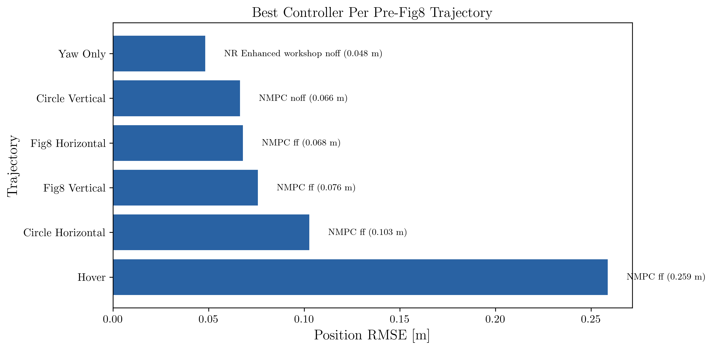

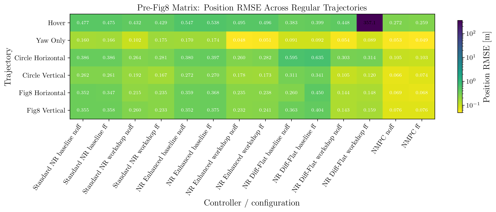

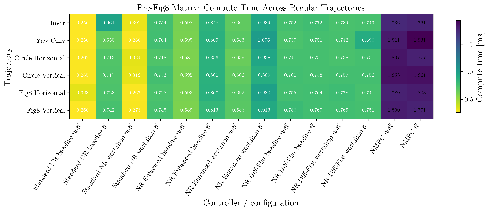

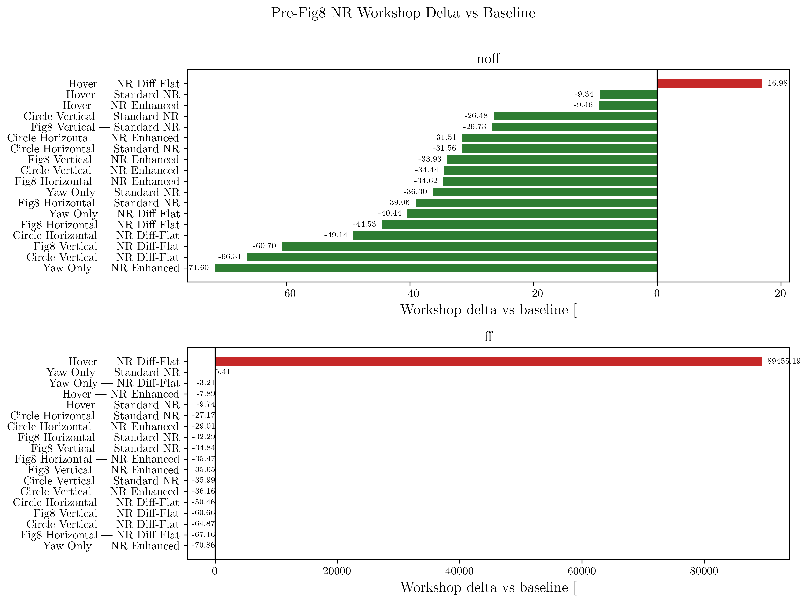

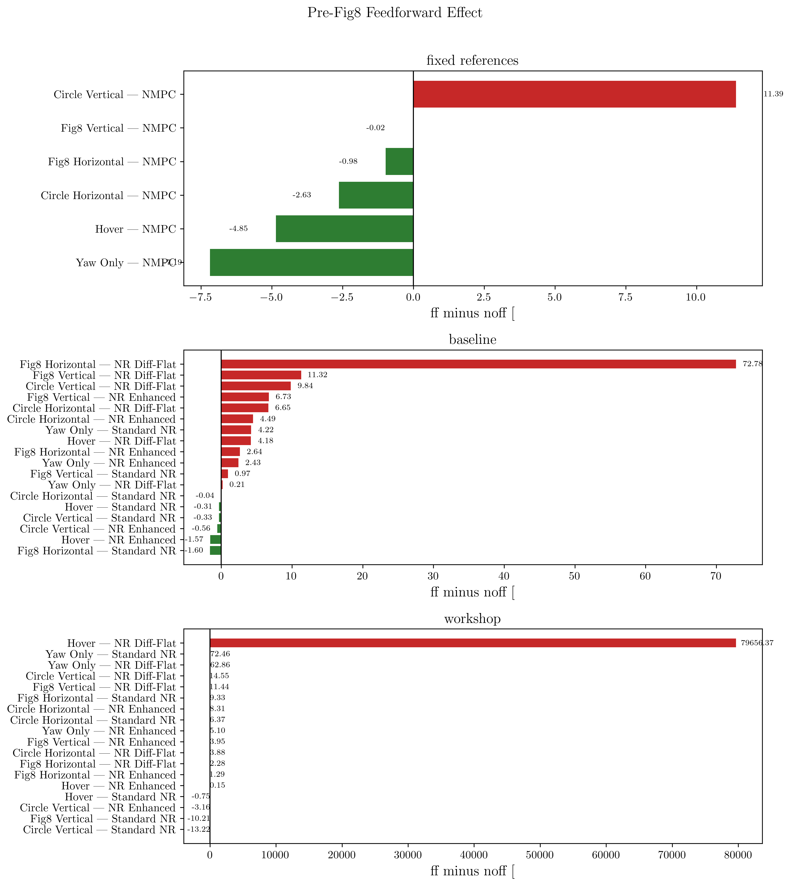

# Reference vs Actual Galleries

These per-trajectory grids compare the flown path against the aligned reference
path for every controller/configuration in the matrix.

## Hover

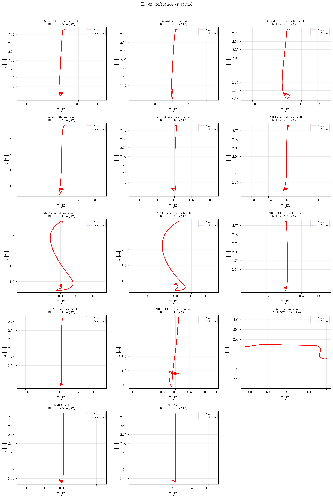

## Yaw Only

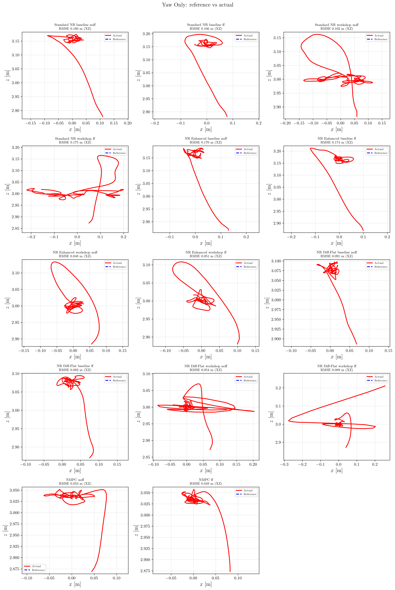

## Circle Horizontal

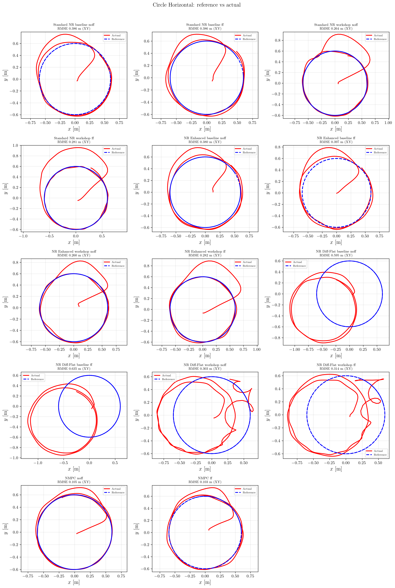

## Circle Vertical

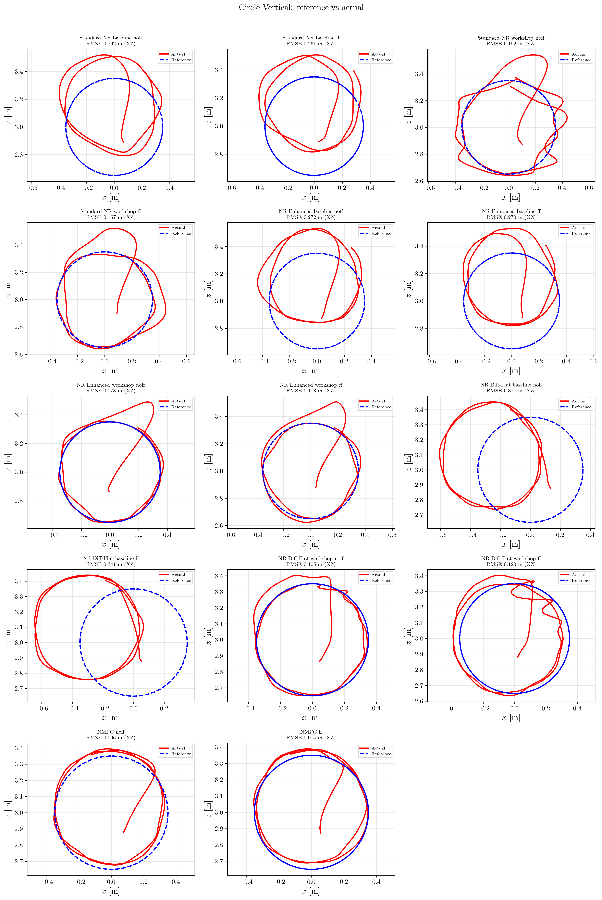

## Fig8 Horizontal

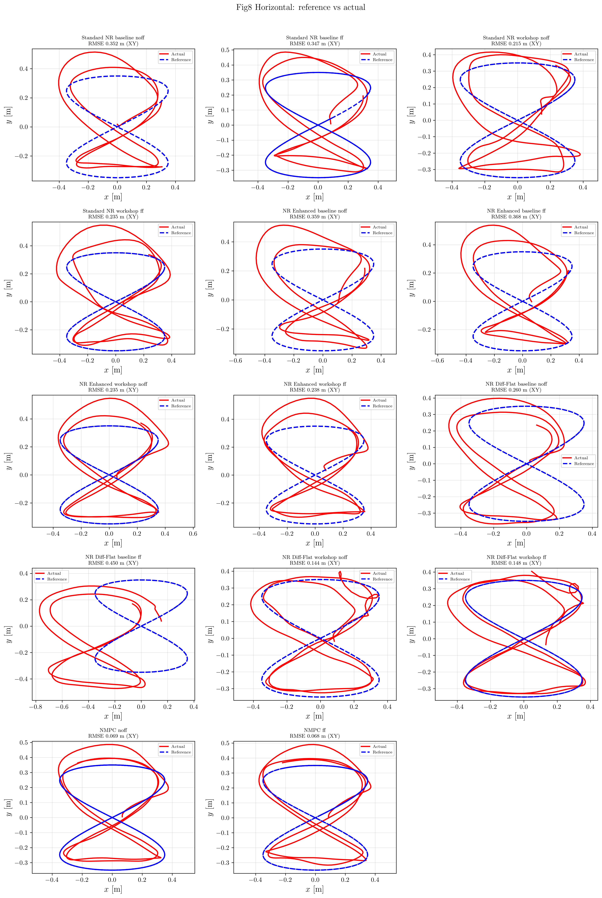

## Fig8 Vertical

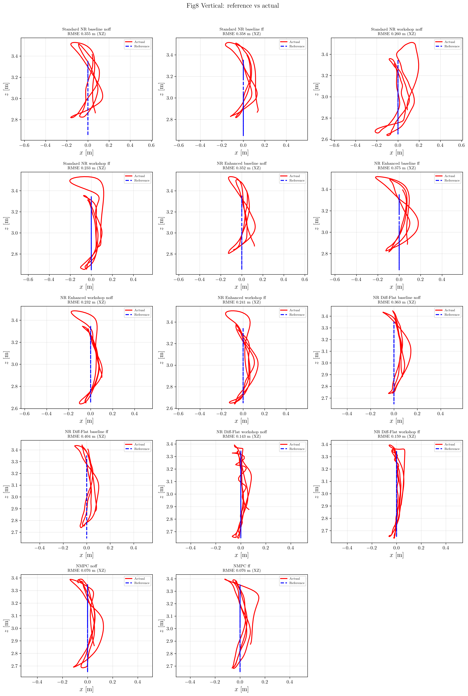

# NR Enhanced Retuning Note

This pass did not land a new `NR Enhanced` tune.

On April 2, 2026, exploratory higher-alpha and shorter-lookahead variants were
tested first on `circle_horz` before widening the sweep. Those variants did not
beat the current Python workshop profile, so no additional `NR Enhanced`
controller change was committed from that tuning thread. The regular-trajectory
matrix in this document therefore reflects the existing validated
`baseline/workshop` split, not an unvalidated retune.
